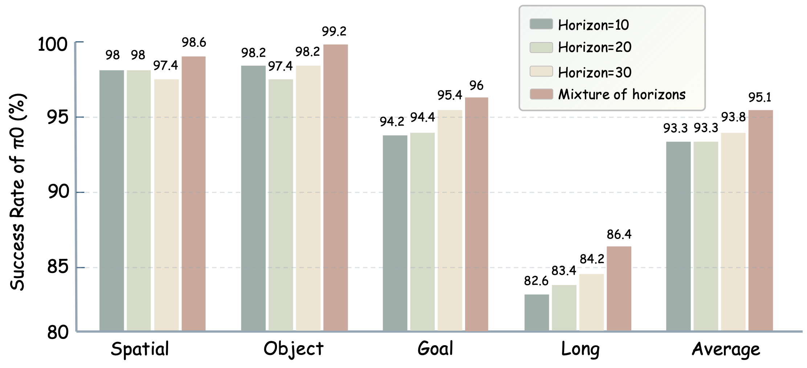
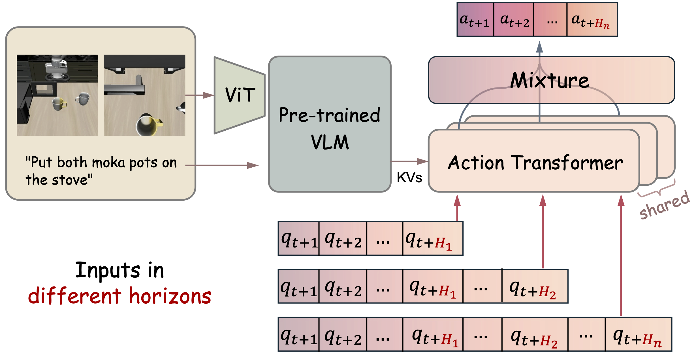
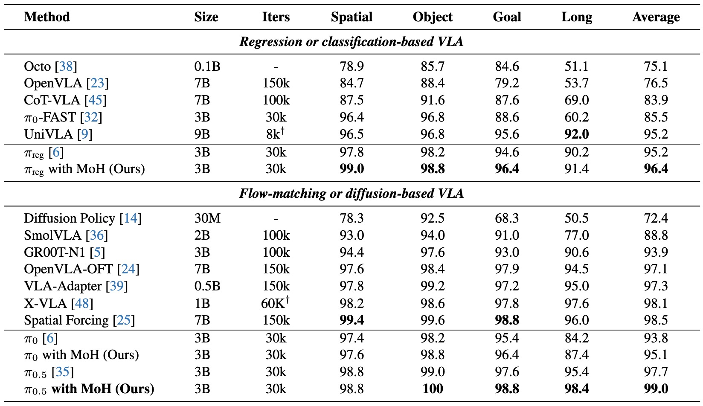

<h1 align="center">Mixture of Horizons in Action Chunking</h1>

<p align="center">
  <a href="https://timsty1.github.io/moh/"></a>
  <a href="https://arxiv.org/abs/2511.19433"></a>
  <a href="https://huggingface.co/Timsty/mixture_of_horizons"></a>
</p>

## 📖 Introduction

<div align="center">
  <table border="0" cellspacing="0" cellpadding="0">
    <tr>
      <td align="center" width="50%">
        
      </td>
      <td align="center" width="50%">
        
      </td>
    </tr>
    <tr>
      <td align="center" valign="top">
        Figure 1: Trade-off between long-term foresight and short-term precision induced by single horizon.
      </td>
      <td align="center" valign="top">
        Figure 2: Overview of the proposed mixture-of-horizons strategy
      </td>
    </tr>
  </table>
</div>

<br>

* VLA models' performance is sensitive to the action chunk length (horizon). The single horizon induces an inherent **trade-off between long-term foresight and short-term precision**.

* We propose **Mixture of Horizons (MoH)**, a plug-and-play strategy that **fuses multiple horizons** within a single policy to inherit the strengths of both with **minimal training or inference overhead**.

* MoH enables **Dynamic Inference**, selecting stable actions through **cross-horizon consensus** for higher efficiency and robustness.

<summary><b>More results on LIBERO</b></summary>
<div align="center">

</div>

## 🚀 Quick Start

### 1. Environment Setup

Clone the repository and set up the conda environment:

```bash
git clone git@github.com:Timsty1/MixtureOfHorizons.git
conda create -n moh -y python=3.10
conda activate moh
pip install uv
cd MixtureOfHorizons
uv pip install -r requirements.txt
pip install packages/libero
pip install packages/openpi-client
```

### 2. Modify Transformers Library

This implementation requires modifying the `transformers` library to support PyTorch-type $\pi$ series models, which rely on *gemma*, *paligemma*, and *siglip*.

First, locate your conda environment path:
```bash
conda info --base
```
Then, copy the provided files to the transformers library directory (replace `YOUR_CONDA_DIR` with the path found above):
```bash
cp -r ./src/openpi/models_pytorch/transformers_replace/* YOUR_CONDA_DIR/envs/moh/lib/python3.10/site-packages/transformers/
```

## 🔥 Training

### Data & Model Preparation
1.  **Dataset:** Download the LIBERO training set in LeRobot format from [HuggingFace](https://huggingface.co/datasets/physical-intelligence/libero).
2.  **Base Models:** Download the PyTorch base models for the $\pi$ series (converted from JAX) from [Here](https://huggingface.co/Timsty/pi_base_models_torch).
3.  **Normalization Stats:** Run the script 'scripts/compute_norm_stats.py' to compute normalization statistics, or use the pre-computed file provided in our [Model Repo](https://huggingface.co/Timsty/mixture_of_horizons/tree/main).


### Configuration
Before training, update the project path in your training scripts (`train.py`, `train_pytorch.py`, or `train_pytorch_moh.py`):
```python
import sys
sys.path.append("YOUR_PROJ_DIR/MixtureOfHorizons/src")
```

Next, modify specific configurations (e.g., `repo_id`, `pytorch_weight_path`) in:
* `scripts/run_train_moh.sh`
* `src/openpi/training/config.py`

### Run Training
We trained our models on 4x A100 (80G) GPUs for 30k iterations with a batch size of 32. To start training with the MoH strategy:

```bash
bash scripts/run_train_moh.sh
```

## 🦾 Evaluation on LIBERO

We provide scripts for both standard evaluation and evaluation using **Dynamic Inference**. 
Our checkpoints are available at [HuggingFace](https://huggingface.co/Timsty/mixture_of_horizons/tree/main).

**Prerequisites:**
* Modify `scripts/eval_on_libero.sh` (or `_dynamic.sh`) to point to your `YOUR_PROJ_DIR` and correct checkpoint paths.

### ⚠️ Important: First Run Setup

If you are running the evaluation for the first time in this conda environment, you must initialize the Libero simulator path configuration.

1.  Run the test command manually in your terminal **without** piping to a log file.
2.  When prompted: `"Do you want to specify a custom path for the dataset folder? (Y/N):"`
3.  Type **N** and press **Enter**.
4.  You can then safely interrupt the process (Ctrl+C).

### Run Evaluation

Once configured, execute the evaluation scripts:

```bash
# Standard Evaluation
bash scripts/eval_on_libero.sh

# Evaluation with Dynamic Inference
bash scripts/eval_on_libero_dynamic.sh
```

> **Resources:** Video records and raw logs of our experiments are available on [Google Drive](https://drive.google.com/file/d/1nvuvkfUhu788zyrrN1SZLdKWeN9TZnxs/view?usp=drive_link).

## ❤️ Acknowledgment

We express our gratitude to [OpenPi](https://github.com/Physical-Intelligence/openpi/tree/main), [LIBERO](https://github.com/Lifelong-Robot-Learning/LIBERO), and [RoboTwin](https://robotwin-platform.github.io/) for their open-source contributions.

## 📝 Citation

If you feel that this paper, models, or codes are helpful, please cite our paper, thanks for your support!

```bibtex
@article{jing2025mixture_of_horizons,
  title={Mixture of Horizons in Action Chunking},
  author={Jing, Dong and Wang, Gang and Liu, Jiaqi and Tang, Weiliang and Sun, Zelong and Yao, Yunchao and Wei, Zhenyu and Liu, Yunhui and Lu, Zhiwu and Ding, Mingyu},
  journal={arXiv preprint arXiv:2511.19433},
  year={2025}
}
```
